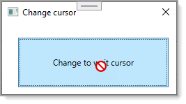

# About

Simple example for changing the cursor to no cursor in this case for five seconds.



```csharp
Imports System.Threading

Public Class CursorHelper
    Public Shared Sub ChangeToWait(Optional mlliSeconds As Integer = 5000)

        Task.Factory.StartNew(
            Sub()

                Windows.Application.Current.Dispatcher.Invoke(Sub() Mouse.OverrideCursor = Cursors.Wait)

                Try
                    Thread.Sleep(mlliSeconds)
                Finally
                    Windows.Application.Current.Dispatcher.Invoke(Sub() Mouse.OverrideCursor = Nothing)
                End Try

            End Sub)

    End Sub
    Public Shared Sub ChangeTo(cursor As Cursor, Optional mlliSeconds As Integer = 5000)

        Task.Factory.StartNew(
            Sub()

                Windows.Application.Current.Dispatcher.Invoke(Sub() Mouse.OverrideCursor = cursor)

                Try
                    Thread.Sleep(mlliSeconds)
                Finally
                    Windows.Application.Current.Dispatcher.Invoke(Sub() Mouse.OverrideCursor = Nothing)
                End Try

            End Sub)

    End Sub
End Class
```