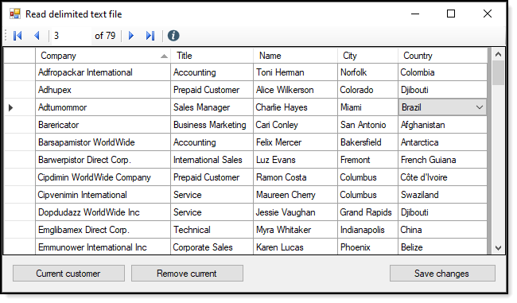
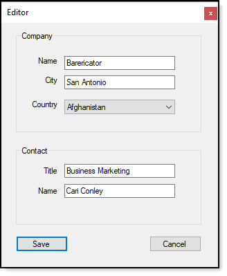

# About

Example for working with data-binding, INotifyPropertyChanged to read, edit, delete and save from a comma-delimited text file displayed in a DataGridView.

The idea is to get VB.NET coders to consider alternate means for working with data with a DataSet or DataTable and consider using classes.

