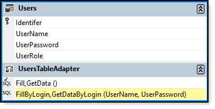
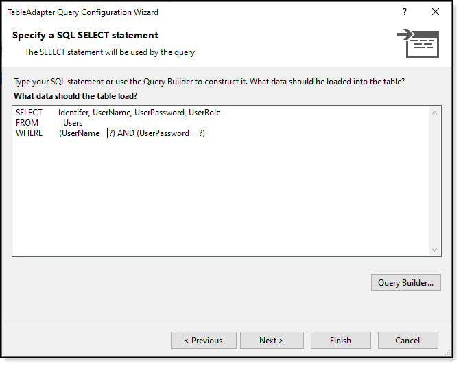

# About

A basic framework to login and work with data using TableAdapters. Note that the database is password protected using **password** as the database password which is stored in the app.config file not encrypted (which it should be).

### User table



### SELECT Query



### Download 
To just download the required projects use the following batch file.

```batch
mkdir code
cd code
git init
git remote add -f origin https://github.com/karenpayneoregon/WorkingWithAccessDatabases
git sparse-checkout init --cone
git sparse-checkout add LoginFrontEnd
git pull origin master
:clean-up
del .gitattributes
del .gitignore
del .yml
del .editorconfig
del *.md
del *.sln

```