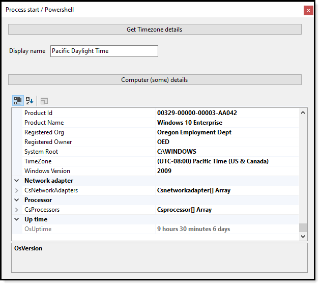

# About

Simple examples for starting an external process, in this case `PowerShell`, wait for the process to finish async then show details.

# Requires

- [.NET5 Framework](https://dotnet.microsoft.com/download)
- [Newtonsoft.Json](http://example.com) NuGet package

---

