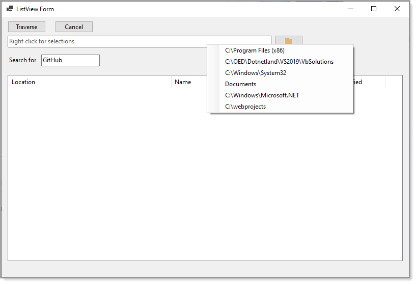

# About

Asynchronous traverse folders code sample.




## Items added

```csharp
Private Async Sub OnTraverseEvent(information As DirectoryItem)

    Await Task.Delay(100)

    FoldersListView.InvokeIfRequired(Sub(listView)
                                         Dim item = New ListViewItem(information.ItemArray)
                                         item.Tag = information
                                         listView.Items.Add(item)
                                     End Sub)

    ProcessingLabel.InvokeIfRequired(Sub(label)
                                         label.Text = $"{FoldersListView.Items.Count}"
                                     End Sub)


End Sub
```

## Select item

```csharp
<Extension>
Public Function GetSelectedItem(listView1 As ListView) As ListViewItem
    Return (If(listView1.SelectedItems.Count > 0, listView1.SelectedItems(0), Nothing))
End Function
<Extension>
Public Function GetSelectedItemTag(listView1 As ListView) As DirectoryItem
    Return (If(listView1.SelectedItems.Count > 0, CType(listView1.SelectedItems(0).Tag, DirectoryItem), Nothing))
End Function
```

### Usage

```csharp
Private Sub OpenFolderContextMenuStrip_Opening(sender As Object, e As ComponentModel.CancelEventArgs) _
    Handles OpenFolderContextMenuStrip.Opening

    If FoldersListView.Items.Count = 0 Then
        e.Cancel = True
    Else
        Dim selected = FoldersListView.GetSelectedItemTag()
        Debug.WriteLine(selected.Location)

    End If

End Sub
```

# Important

There are various code sample that have hard coded paths e.g. 

```csharp
Dim folderName = "C:\OED\Dotnetland\VS2019"
```

Before running the code samples look over the code for paths that don't exists on your computer and change them to folders that does exists.

In the ListViewForm, note the context menu for folder to search, there is a menu item *Documents* which will be converted to the current user's document folder and should work fine.


# TechNet article

https://social.technet.microsoft.com/wiki/contents/articles/54224.iterating-directories-and-files-vb-net.aspx