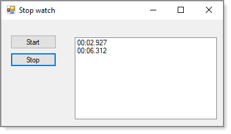

# About

Code sample to show how to use a StopWatch accessed from a `singleton` class.

- Provides log to file.
- Ready for customization

### Sample log file

Can be customize as a developer sees fit

```
2021/06/11 09:08:03,,StartButton_Click
2021/06/11 09:08:10,00:06.486,Whatever
2021/06/11 09:11:26,,StartButton_Click
2021/06/11 09:11:29,00:02.927,Whatever
2021/06/11 09:11:32,,StartButton_Click
2021/06/11 09:11:39,00:06.312,Whatever
```

