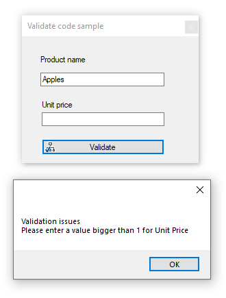

# Form validate with Annotations

Very basic code sample for validating user input using data annotations.

### Uses

- WinFormsValidation project
- WinFormsControls project 

### Requies 

- NuGet package to [System.ComponentModel.DataAnnotations](https://www.nuget.org/packages/System.ComponentModel.Annotations/) 
- .NET 5 Framework

### Below .NET 5

See [the following version](https://github.com/karenpayneoregon/ClassValidationVisualBasic/tree/master/ValidatorLibrary) (requires a reference or package for System.ComponentModel.DataAnnotations)

