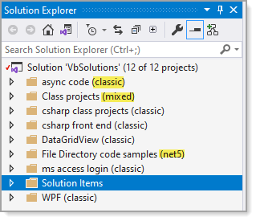

# About

Code samples for VB.NET written in Visual Studio 2019.

# Notes

- Some code samples will be .NET Core while others ported from Visual Studio 2017.
- Code samples will be added over time.
- See older code samples in [this repository](https://github.com/karenpayneoregon/visual-basic-getting-started).

# Solution folders

The highlighted text shows the .NET Framework for projects within a solution folder.

